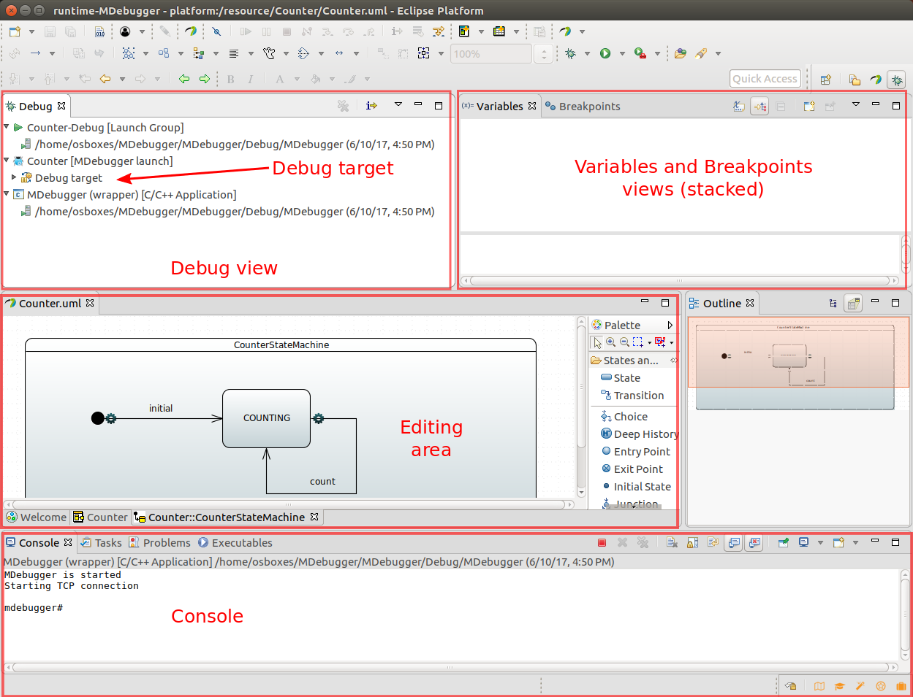
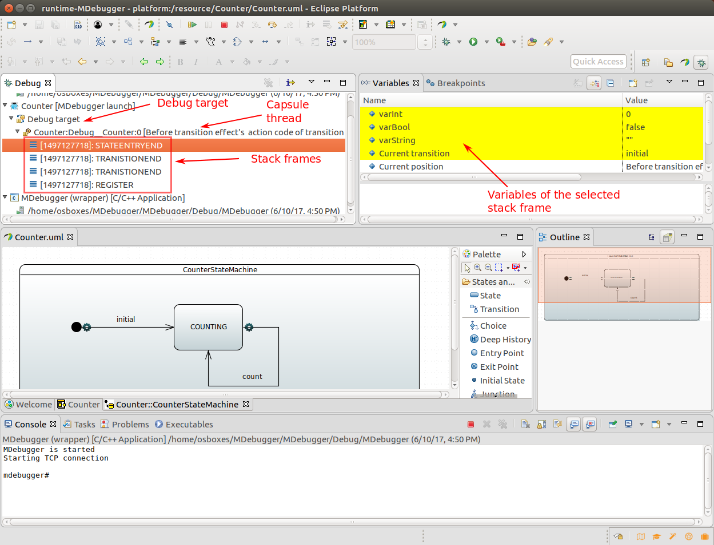
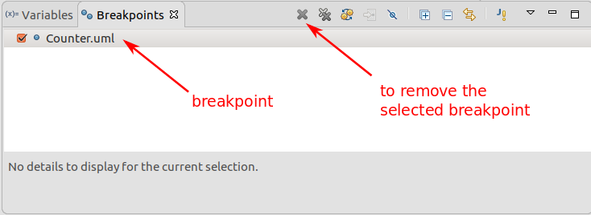
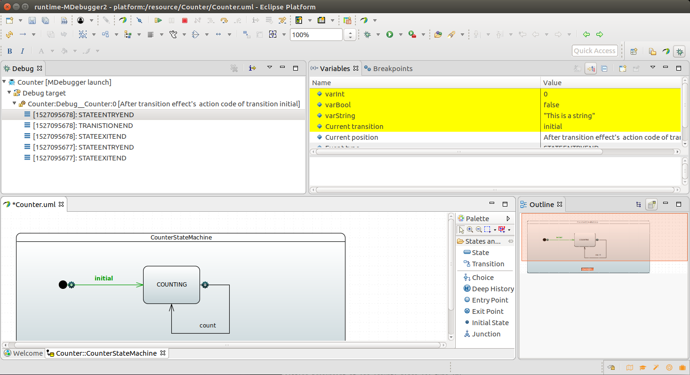

# MDebugger Eclipse Integration
MDebugger can be used within Eclipse. To do so, we have provided an integration with the Eclipse debugger API.

## Running
This part assumes that you have already read [how to run the MDebugger program in command-line](https://github.com/moji1/MDebugger), and that you performed the steps 1 to 3, i.e., generated the instrumented code of the sample model (PingPong model or Counter model) using “generate code (Debug)“, and compiled the instrumented code. All the following steps are performed in the second Eclipse instance.

- Step 1 (Execute the instrumented model)
  1. First, run the debuggable program of the counter model using the following command:
    
         ```
         $ cd /home/osboxes/runtime-MDebugger/Counter_CDTProject/src
         $ make
         $ ./Debug__TopMain
         ```
     Upon successful execution, the following result should be shown in terminal.  
            
            
  2. This time, the MDebugger CLI tool will be only used as a wrapper. For convenience purpose, we have created a debug configuration that can be launched by selecting “Run / Run History / Counter-Debug“ in the Eclipse menubar. 
  
  
  
  This debug configuration will execute sequentially the following steps:
      1. It first runs a debug target used for debugging the application in Eclipse;
      2. It then runs the MDebugger CLI tool only as a wrapper to communicate with the debug target in Eclipse.
      
  3. If the Counter model was not open, it will be opened automatically. If the debug perspective was not active, Eclipse will ask you to open it. 
  
    
    
    Once confirmed, the main debug interface will be displayed. It consist on the following parts:
  
    * A **Debug** view containing three main items: 
      * **Counter [MDebugger launch]** is the Eclipse debug target;
      * **MDebugger (wrapper) [C/C++ Application]** is the command-line debugger that is only used as a wrapper;
      * **Counter-Debug [Launch Group]** is the debug configuration we have created for convenient purpose;
    * A **Variables** view listing the different variables of a capsule instance when a stack frame is selected;
    * A **Breakpoints** view lists all breakpoints set on this model;
    * The **Editing area** showing the *Counter* model;
    * The **Console** in which it is still possible to invoke the MDebugger CLI tool using command lines. 
      
       

    
   
## Debugging

Now the Eclipse debugger has been launched, a *Debug target* has been created, and a small icon in the top-left corner shows that the Counter application has been paused. A *Debug target* consists of *threads*, each thread represents the execution of a capsule instance in UML-RT. If you are debugging the Counter model, only one thread, called *Counter:Debug\_\_Counter:0* has been created. On the right side of the thread name, its current state appears between brackets. This current state show the current position of the debug pointer in the model. Initially, the current state is before the action code of the initial transition to be executed.



When a capsule thread is paused, a small icon appears on the bottom-left corner of the capsule thread to notify the programmer that this capsule thread is not running. When paused, a capsule thread displays the list of the five last events that occured. Each event is represented as a *stack frame* of the capsule thread. 

### Listing and changing variables

Variable states and values are associated with a specific stack frame, hence a specific event. It means that the current variable values are valid when this event has occured. Selecting another event will show different values. Variables appearing with a yellow background shows variables whose value has been changed since the last event.

The four last variables *Current transition*, *Current position*, *Event type*, and *Event source kind*, are internal to the debugger and therefore, cannot be changed. For all other variables, it is possible to click on a value to change it. Changing a value will cause the debugger to send the proper command to the MDebugger CLI tool in order to set the new value. Consequently, new events will be generated, which causes the **Debug** view to refresh the list of the last five events that occured for the selected capsule instance.


### Listing, adding, and removing breakpoints

Using the **Editing area** and the **Breakpoints** view, it is possible to create, remove, and list all breakpoints of the model. When opening the first time the debug target, the list of breakpoints in the **Breakpoints** view is currently empty, as no breakpoint has been added yet. The following explains how to create, list, and remove breakpoints using the **Editing area** and the **Breakpoints** view jointly.

#### Inserting a breakpoint

Creating breakpoints is done directly to the model opened in the **Editing area**. the first step is to right-click on any transition or entry/exit action code of a state in the state machine. Doing so, a *MDebugger* entry can be selected, and four actions are available:
- *Insert breakpoint after action code:* cause a breakpoint to be created after the action code of this specific transition, state entry, or state exit;
- *Insert breakpoint before action code:* cause a breakpoint to be created before the action code of this specific transition, state entry, or state exit;
- *Disable breakpoint after action code:* cause an existing breakpoint (if any) previously inserted after the action code to be removed;
- *Disable breakpoint before action code:* cause an existing breakpoint (if any) previously inserted before the action code to be removed.

In the figure below, right-clicking on the *count* transition on the *CounterStateMachine* causes the context menu to open. It contains the *MDebugger (transition effect)* entry, which consists of the four aforementioned actions to add and remove breakpoints on the selected transition (before and after the transition effect).

Clicking on the *Insert breakpoint after action code* causes a breakpoint to be created after the action code of the *count* transition is executed.


#### Listing breakpoints

Once a breakpoint is created using the editing area, it is automatically added to the **Breakpoint** view. The figure below shows the **Breakpoint** view. Make sure that the figure is revealed over the **Variables** view (by clicking on the **Breakpoint** tab).



#### Deleting breakpoints

Deleting a breakpoint can be done either in the **Editing area** or in the **breakpoints** view:

* Using the **Editing area**, it is possible to right-click on a transition, state entry, or state exit, and select the "Disable breakpoint ..." entry in the contextual menu. In the screenshot available in the subsection above entitled ["Inserting a breakpoint"](https://github.com/moji1/MDebugger/blob/master/MDebugger-Eclipse-GUI/README.md#inserting-a-breakpoint), right-clicking on the *count* transition causes the context menu to open. Under the *MDebugger (transition effect)* entry, it is possible to select the *Disable breakpoint after action code* action to disable the previously created breakpoint;
* Using the **Breakpoints** view, it is possible to select a breakpoint in the list of breakpoints, and hit the *Remove selected breakpoint (Delete)* icon (see screenshot above).

#### Further improvements on supporting breakpoints in the GUI version

Further improvements can be done to the Eclipse implementation to improve the user experience. They include:
- Displaying user-friendly label in the **Breakpoints** view (currently, only the affected resource name is used);
- Graphically displaying breakpoints directly on the diagrams;
- Right now, a breakpoint can be added or removed. However, disabled or re-enabling a breakpoint using the checkbox on the left side of the breakpoint has no effect.

### Stepping over the execution

Using the Eclipse toolbar, it is possible to stepping over the execution of one capsule instance. To do so, a capsule thread (or a subsequent stack frame within the capsule thread) has to be selected first. Then, hitting the *Step Over* icon in the menu bar (or pressing <kbd>F6</kbd>) will cause the capsule thread to step over the execution.


The list of the last five events is furthermore refreshed, as well as the current state of the capsule thread, which is now: *After transition effect's action code of transition initial*. Stepping over can be done multiple times, causing the Counter capsule to enter the *COUNTING* state, firing the *count* transition, etc.




### Resuming execution

Using the Eclipse debugger integration, it is also possible to resume the execution of the system using the *Resume* icon (or by pressing <kbd>F8</kbd>) in the Eclipse toolbar. Doing so will command the MDebugger to resume the execution until a breakpoint is reached.


### Switching back to the command-line debugger

When using the Eclipse debugger, it is always possible to switch back to the command-line debugger. The latter is opened in the **Console** view, and commands written in it.
