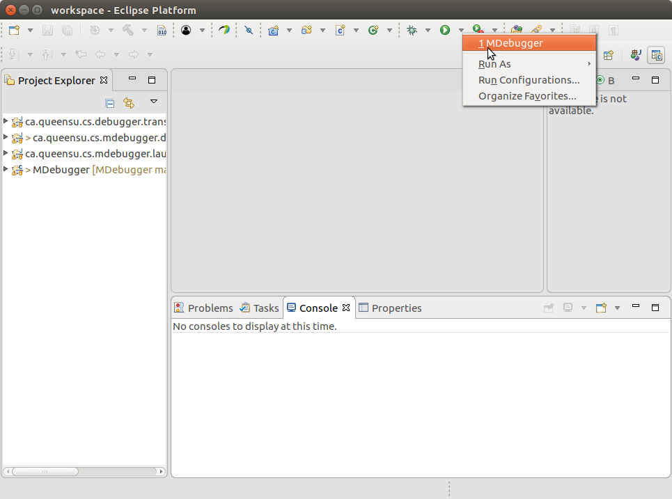

# Welcome to MDebugger Page
MDebugger is a model-level debugger of [PapyrysRT](https://eclipse.org/papyrus-rt/) (Papyrus for Real-time). Papyrus-RT is an Eclipse-based, open-source modelling development environment for UML-RT systems. It allows the generation of complete, executable code from models and advances the state-of-art via support for model representation with mixed graphical/textual notations and an extensible code generator. Uisng MDebugger, we can debug the UML-RT models on the target platfrom without using program debugger or refering to the generated code. The core of the MDebugger is developed at model-level uisng model transformation techniques. The more information about how MDebugger is developed can be found in our [FSE 2017] paper.


## Starting Guide:
### Virtual Machine

To facilitate the researchers and developers to use MDebugger, we prepare a [virtual machine](http://mase.cs.queensu.ca/fse-artifact/MDebugger.ova) uisng Oracle VirtualBox. It includes MDebugger source  and all required software (e.g., PapyrusRT). The virtual machine can be downloaded from the following link:
http://mase.cs.queensu.ca/fse-artifact/MDebugger.ova

[Here](https://www.youtube.com/watch?v=ZCfRtQ7-bh8 ) you can find out how to import the OVA file in Oracle Virtualbox. 


We set up the credential, “osboxes” as the username and “osboxes.org” as the password, for the VM. The source code directory of MDebugger is ```/home/osboxes/MDebugger``` and PapyrusRT is insatled at ```/home/osboxes/papyrus-rt-devtest-latest/Papyrus-RT/``` and can be run uisng ```/home/osboxes/papyrus-rt-devtest-latest/Papyrus-RT/eclipse```


## Running
Please note that we assume that you download the VM and successfully started the VM.
- Step 0 (Run PapyrusRT):
    1. Open a terminal and execute  ```/home/osboxes/papyrus-rt-devtest-latest/Papyrus-RT/eclipse```.  You can run the Eclipse from the lanucher menu at the left side of the desktop.
    2. The Eclipse launcher will be shown, use the default workspace (i.e., /home/osboxes/workspace) and press the Launch.
    3. Run the MDebugger as shown in the following figure. It will open a new Eclipse instance. Inside the new Eclipse instance, you can generate the debug code from models, build, and debug them. 
     
    

- Step 1  (Generate debuggable code):
Please note that you need to follow the remained  steps inside the second instance of Eclipse. 
    1. For the purpose of evaluation, we have defined two sample models (PingPong and Counter) in the default workspace. To         generated  debuggable code for the model, frist open the models by double clicking on them or by righ click and select open,  as shown in the following figure.
    
    2. To generate the debug code,  right click on the root element of the openned model and select generate code (Debug) menu as shown in the following figure. 
    
    3. After selecting the cenerate code (Debug) menu, a dialog box will show the result of the code generation.  
    
    Also, you can create the modeling project based on the UML-RT language and generate the executable C++ code. you may find a tourial and detail information [here](https://wiki.eclipse.org/Papyrus-RT/User/User_Guide/Getting_Started).  


- Step 2 : Build the generated code
    1. Generated debug code is in C++ langauge and can be build similar to any C++ program. To build the code you can use the build menu by right click on the generated code  as shown in the following figure.
     
    2.Also, you  can use the terminal to run build the code using a generated make file. For instance  the following commands show how to build the generated code for the counter model.
    ``` cd /home/osboxes/runtime-MDebugger/Counter_CDTProject/src```
    ```make```
    Similarly, Use  ```/home/osboxes/runtime-MDebugger/PingPong_CDTProject/src   && make ``` for the PingPong model.
    3. Result of the build in both cases is a debuggable program and its name is ```Debug__TopMain```. Use ```./Debug__TopMain``` to run that.

- Step 3 : Debug the code using command line interface
    1. Now the debuggable program is ready, and you can debug them using MDebugger. Let's assume that we want to debug the counter model.
    2. Frist, run the debuggable program of the counter model using the following command:
    
         ```
         cd /home/osboxes/runtime-MDebugger/Counter_CDTProject/src
         ./Debug__TopMain
         ```
          Upon successful execution, the following result should be shown in terminal.  
            
     3. After execution of the program, open a new terminal and run the MDebugger uisng the following commands:
         ```
          cd /home/osboxes/MDebugger/MDebugger/Debug/
         ./MDebugger 
         
         ```
         Upon successful execution, the following result should be shown in terminal. 
          
     4. You have several debugging commands to debug the counter model. Use help to see a full list of commands. 
        For instance:
                    Use "list" to see the running capsules (i.e., similar to thread in programin languages). 
                    Use "n -c capsule name" to step over the execuation of the capsules.
                    Use "b -c ...." to set breakpoint
                    and so on. 
     5. The following shows  a full list of the MDebugger commands, and here is a short video which show how to use the MDebugger.
                    
- Step 4 : Use the GUI interface:

### Evaluation Scenarios
### Developer Guide
### Other Resources


### Support or Contact

