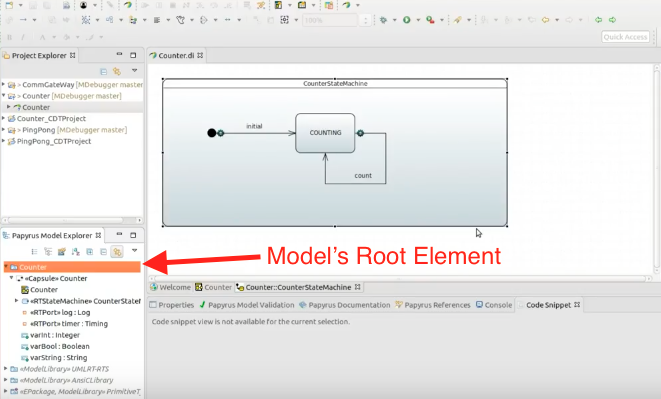
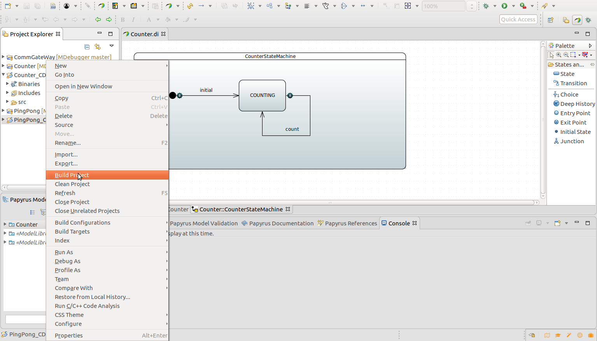
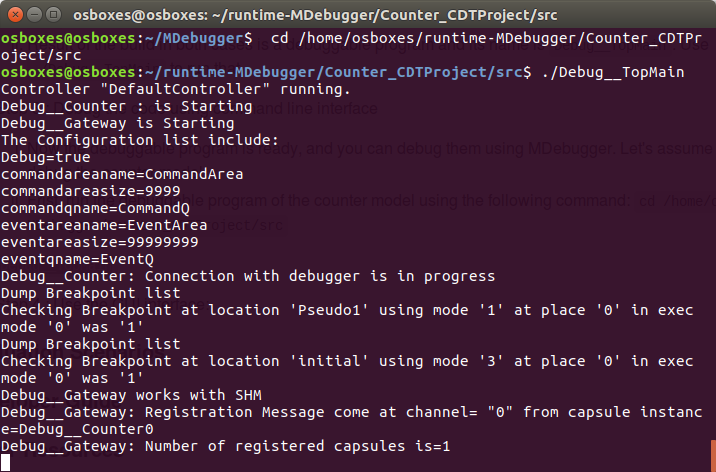
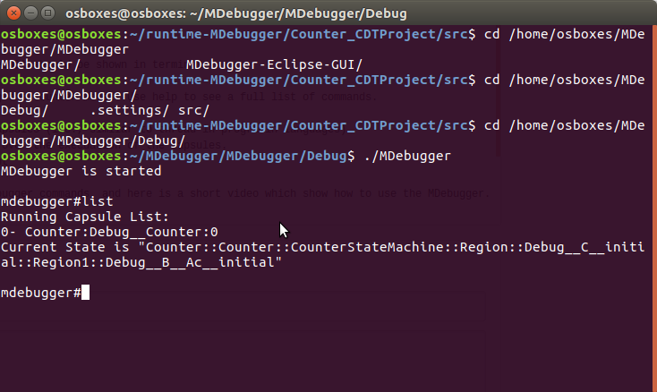
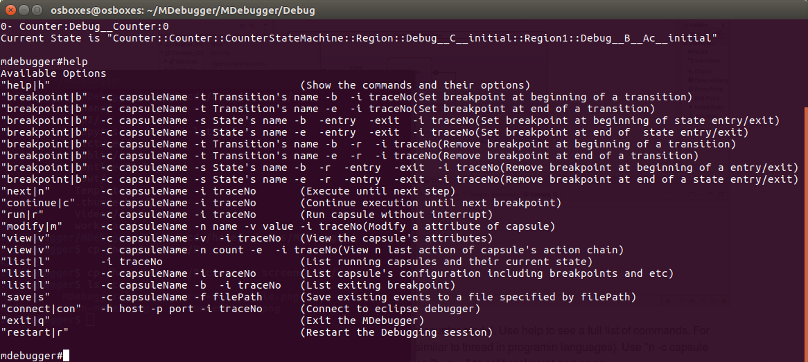

# Welcome to MDebugger Page
MDebugger is a model-level debugger of [Eclipse Papyrus for Real-time](https://eclipse.org/papyrus-rt/) (Papyrus-RT). Papyrus-RT is an Eclipse-based, open-source modelling development environment for UML-RT systems. It allows the generation of complete, executable code from models and advances the state-of-art via support for model representation with mixed graphical/textual notations and an extensible code generator. Using MDebugger, we can debug UML-RT models on the target platfrom without using program debugger or refering to the generated code. The core of the MDebugger is developed at model-level uisng model transformation techniques. A detailed description of the model-level debugger can be found in our [FSE 2017] paper.


## Starting Guide:
### Virtual Machine

To help researchers and developers to use MDebugger, we prepared a [virtual machine](http://mase.cs.queensu.ca/fse-artifact/MDebugger.ova) using Oracle VirtualBox. It includes MDebugger source  and all required software (e.g., PapyrusRT). The virtual machine can be downloaded from the following links:

http://mase.cs.queensu.ca/fse-artifact/MDebugger.ova
https://drive.google.com/file/d/0BzxhsAV1WGFRcXdHRHh4Zl85QXM/view?usp=sharing

[Here](https://www.youtube.com/watch?v=ZCfRtQ7-bh8 ) you can find out how to import the OVA file in Oracle Virtualbox. 


We set up the credential, “osboxes” as the username and “osboxes.org” as the password, for the VM. The source code directory of MDebugger is ```/home/osboxes/MDebugger``` and PapyrusRT is instaled at ```/home/osboxes/papyrus-rt-devtest-latest/Papyrus-RT/``` and can be run uisng ```/home/osboxes/papyrus-rt-devtest-latest/Papyrus-RT/eclipse```


## Running
Please note that we assume that you downloaded and started the VM successfully.
- Step 0 (Run PapyrusRT):
    1. Open a terminal and execute  ```/home/osboxes/papyrus-rt-devtest-latest/Papyrus-RT/eclipse```.  You can run the Eclipse from the launcher menu at the left side of the desktop.
    2. The Eclipse launcher will be shown, use the default workspace (i.e., /home/osboxes/workspace) and press the Launch.
    3. Run MDebugger as shown in the following figure. It will open a new Eclipse instance. Inside the new Eclipse instance, you can generate the debug code from UML-RT models, build it, and debug it. 
     
    

- Step 1  (Generate debuggable code):
Please note that you need to follow the remaining steps inside the second instance of Eclipse. 
    1. For the purpose of evaluation, we have defined two sample models (PingPong and Counter project) in the default workspace. To generate debuggable code for a model, first, open a model's project, and then open the model by double-clicking on it or by right-clicking and selecting “open“,  as shown in the following figure. 
    
    2. To generate the debug code, right-click on the root element of the opened model and select “generate code (Debug)“ menu as shown in the following figures.
    
    
    3. After selecting the generate code (Debug) menu, a dialog box will show the result of the code generation.  
    
    Also, you can create the modeling project based on the UML-RT language and generate the executable C++ code. you may find a tutorial and detail information [here](https://wiki.eclipse.org/Papyrus-RT/User/User_Guide/Getting_Started).  


- Step 2 : Build the generated code
    1. The generated debug code is in C++ language and can be built similarly to any C++ program. To build the code you can use the build menu by right-clicking on the generated code as shown in the following figure.
     
    2.Also, you can use the terminal to build the code using the generated makefile. For instance, the following commands show how to build the generated code for the counter model.
    ``` cd /home/osboxes/runtime-MDebugger/Counter_CDTProject/src```
    ```make```
    Similarly, Use  ```/home/osboxes/runtime-MDebugger/PingPong_CDTProject/src && make ``` for the PingPong model.
    3. The result of the build in both cases is a debuggable program and its name is ```Debug__TopMain```. Use ```./Debug__TopMain``` to run that.

- Step 3 : Debug the code using command line interface
    1. Now the debuggable program is ready, and you can debug them using MDebugger. Let's assume that we want to debug the counter model.
    2. First, run the debuggable program of the counter model using the following command:
    
         ```
         cd /home/osboxes/runtime-MDebugger/Counter_CDTProject/src
         ./Debug__TopMain
         ```
          Upon successful execution, the following result should be shown in terminal.  
            
     3. After execution of the program, open a new terminal and run the MDebugger uisng the following commands:
         ```
          cd /home/osboxes/MDebugger/MDebugger/Debug/
         ./MDebugger list
         
         ```
         Upon successful execution, the following result should be shown in the terminal. 
          
     4. You have several debugging commands to debug the counter model. Use help to see a full list of commands. 
        For in use "list" to see the running capsules, 
                    use "n -c capsule name" to step over the execuation of the capsules,
                    use "b -c ...." to set breakpoint,
                    and so on. 
     5. The following figure shows a full list of the MDebugger commands.
                 
- Step 4 : Use the GUI interface: see [this page](https://github.com/moji1/MDebugger/tree/master/MDebugger-Eclipse-GUI).

### Video Tutorials
- [Debugging Using Command Line User Interface](https://youtu.be/UJ4BYSOrTOQ)
- [Debugging Using Graphical User Interface](https://youtu.be/PvPbV5QkQ9Y)
<!-- .### Evaluation Scenarios
### Developer Guide
### Other Resources
### Support or Contact--!>

